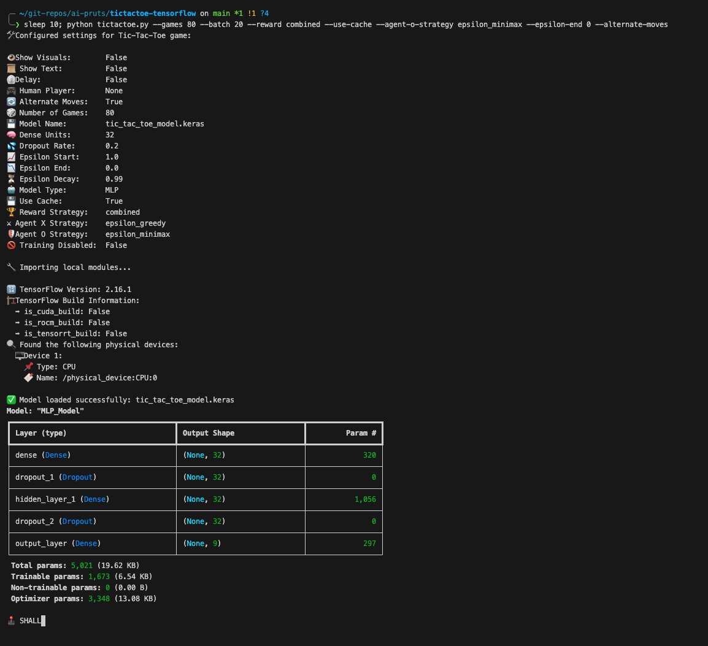
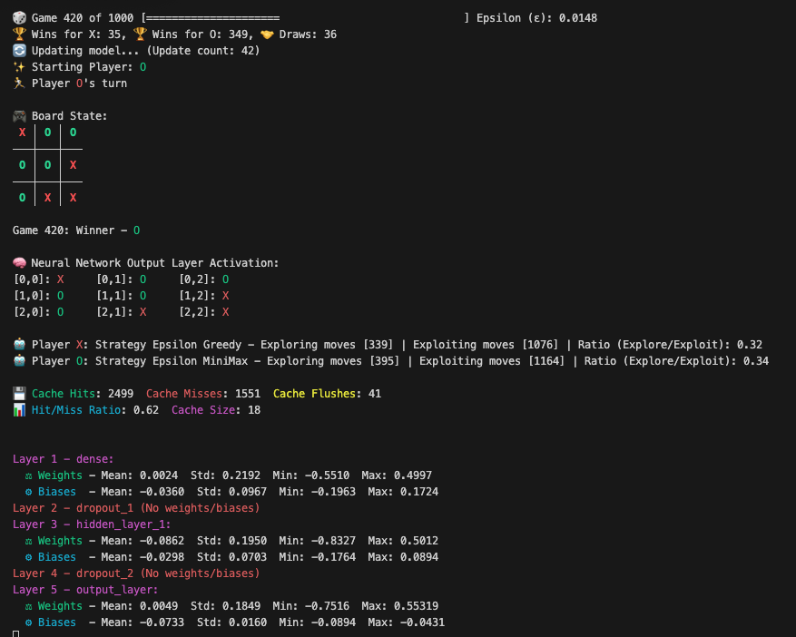

# Tic-Tac-Toe Neural Network Training Script

This repository contains a Python script for running a customizable Tic-Tac-Toe game simulation with AI training and visual analytics. This script was developed as a learning project to explore AI training and visualization techniques in the context of a Tic-Tac-Toe game. It incorporates various AI strategies and reward functions to demonstrate different approaches to training an AI agent. I created it with the help of a other AI just for fun, wanted to learn a little about training a neural network by playing Tic-Tac-Toe. It utilizes TensorFlow to create and train a neural network. The game includes various visualization features for the neural network's layers, activations, and game statistics, as well as command-line arguments to customize the game and training settings.

## Features

- **Visualizations**: Enable game visuals and text for an interactive experience.
- **Customizable AI Strategies**: Choose from various AI strategies for both X and O agents.
- **Human vs AI or AI vs AI Gameplay**: Play as a human or watch AI vs AI games.
- **Model Training and Adjustment**: Train AI models with different strategies, rewards, and configurations.
- **Neural Network Models**: Choose between MLP, CNN, and RNN models.
- **Game Visualization**: Visualize the neural network's input, output, weights, biases, and detailed network structure during gameplay.
- **TensorFlow Integration**: Leverage TensorFlow for model training and prediction.

## Saving and Loading the Model
The model is automatically saved after training and can be loaded when the script is run again, allowing for continuous learning.

## Requirements
- Python 3.x
- TensorFlow
- NumPy
- Matplotlib
- Colorama
- IPython (for interactive display features)

## Installation
1. **Install Python**: Download and install Python from [python.org](https://www.python.org/).
2. **Install Dependencies**: Run `pip install numpy tensorflow matplotlib colorama ipython`.
3. **Download the Script**: Clone or download the script from the repository.

## Usage
Run the script from the command line with desired arguments. For example:

```bash
python tic_tac_toe.py --show-visuals --games 100 --model-type MLP

python tic_tac_toe.py --games 1000 --model-type MLP --model-name mlp-model.keras --dense-units 16
```

### Available Arguments
The arguments for this Python script provide extensive customization for running a Tic-Tac-Toe game with an AI. Here are detailed explanations for each argument:

- `--show-visuals`: Enables real-time visualizations of the game board and AI predictions, enhancing the interactive experience.
- `--show-text`: Activates text-based output for game events and AI decisions, useful for detailed monitoring of game progress.
- `--delay`: Introduces a delay between moves, allowing more time to observe and analyze AI behavior and game dynamics.
- `--human-player [X/O/None]`: Allows a human player to participate as X or O against the AI, or set to None for AI vs AI games.
- `--alternate-moves`: Alternates the starting player between X and O in successive games, ensuring balanced gameplay.
- `--games [integer]`: Specifies the total number of games to be played in the simulation, controlling the length of the training session. Default is 10.
- `--batch-size [integer]`: Determines the batch size for model updates, with a default of one-tenth the total number of games. 
- `--model-name [string]`: Sets the filename for saving or loading the AI model, facilitating model reuse and continuous training. Default is 'tic_tac_toe_model.keras'.
- `--dense-units [integer]`: Defines the number of neurons in each Dense layer of the neural network, impacting the model's complexity. Default is 32.
- `--dropout-rate [float]`: Sets the dropout rate in Dropout layers, a technique to prevent overfitting in the neural network. Default is 0.2.
- `--epsilon-start [float]`: Initial value of epsilon in epsilon-greedy strategy, governing the balance between exploration and exploitation. Default is 1.0.
- `--epsilon-end [float]`: Final value of epsilon after decay, indicating the strategy's shift towards more exploitation over time. Default is 0.1.
- `--epsilon-decay [float]`: Epsilon decay rate after each game, controlling the rate at which the strategy moves from exploration to exploitation. Default is 0.99.
- `--model-type [MLP/Policy/Value/CNN/RNN/Simple]`: Selects the AI model type, with options including MLP, CNN, RNN, and others, each offering different learning capabilities. Default is 'MLP'.
- `--use-cache`: Enables caching of model predictions to speed up the simulation. Default is False.
- `--reward [block/progress/penalty/simple/future/combined/win_moves/winning_sequence/opponent_penalty/leadingupto]`: Chooses the reward strategy for training the AI, affecting how the model learns from game outcomes. Default is 'progress'.
- `--agent-x-strategy [epsilon_greedy/random/softmax/ucb/minimax/epsilon_minimax]`: Determines the strategy for Agent X, influencing its decision-making process during the game. Default is 'epsilon_greedy'.
- `--agent-o-strategy [epsilon_greedy/random/softmax/ucb/minimax/epsilon_minimax]`: Sets the strategy for Agent O, similarly impacting its gameplay tactics. Default is 'epsilon_greedy'.
- `--train-disable`: Disables model training and updates.
- `--debug`: Debug stuff. Default is False.

These arguments provide a wide range of configurations to tailor the gameplay experience and AI behavior, offering both an engaging game for players and a rich environment for AI training and research.

## Screenshots

`Startup`



`--show-text`



`--show-visuals`


##  Neural network models
The provided code defines several neural network models using TensorFlow and Keras, each tailored for different aspects of learning and decision-making in a Tic-Tac-Toe game. Here's a detailed explanation of each model:

### 1. Multi-Layer Perceptron (MLP) Model

#### create_mlp_model(input_shape, dense_units, dropout_rate)
- **Purpose**: A general-purpose neural network model for predicting the best moves in Tic-Tac-Toe.
- **Architecture**:
  - **Input Layer**: Dense layer with `dense_units` neurons, using ReLU activation. It receives the game state as input.
  - **Hidden Layers**: Two dense layers with `dense_units` neurons each, separated by dropout layers. The dropout layers help prevent overfitting by randomly setting a fraction of the input units to 0 during training.
  - **Output Layer**: A dense layer with 9 neurons (one for each cell of the Tic-Tac-Toe board), using linear activation to predict the value for each possible move.
- **Compilation**: Uses the Adam optimizer and mean squared error loss function, suitable for regression problems.

### 2. Policy MLP Model

#### create_policy_mlp_model(input_shape, dense_units, dropout_rate)
- **Purpose**: Designed for classification tasks, predicting the probability of each move being the best choice.
- **Architecture**: Similar to `create_mlp_model`, but the output layer uses softmax activation for multi-class classification, making it suitable for selecting moves based on their probability.
- **Compilation**: Uses categorical cross-entropy as the loss function and includes an accuracy metric, which is common for classification problems.

### 3. Value MLP Model

#### create_value_mlp_model(input_shape, dense_units, dropout_rate)
- **Purpose**: A value-based approach where the model predicts a single value representing the desirability of the current board state.
- **Architecture**: Similar to `create_mlp_model`, but with only one neuron in the output layer using tanh activation. This is typical for value-based reinforcement learning where the output represents an estimation of the state's value.
- **Compilation**: Compiled with mean squared error loss, as it's essentially a regression problem.

### 4. Convolutional Neural Network (CNN) Model

#### create_cnn_model(input_shape, dense_units, dropout_rate)
- **Purpose**: Leverages the spatial structure of the Tic-Tac-Toe board using convolutional layers.
- **Architecture**:
  - **Input Layer**: Reshapes the input to a 3x3 grid.
  - **Convolutional Layer**: A 2D convolutional layer that processes the grid.
  - **Flatten Layer**: Flattens the output from the convolutional layer.
  - **Hidden Layer**: A dense layer with ReLU activation.
  - **Output Layer**: Similar to the MLP model, outputs linear activations for each possible move.
- **Compilation**: Compiled like the MLP model, focusing on regression.

### 5. Recurrent Neural Network (RNN) Model

#### create_rnn_model(input_shape, dense_units, dropout_rate)
- **Purpose**: Uses RNN to capture the sequential nature of the game moves.
- **Architecture**:
  - **Input Layer**: Reshapes the input into a sequence (one element for each cell on the board).
  - **RNN Layer**: A SimpleRNN layer to process the sequence data.
  - **Hidden and Output Layers**: Similar to the MLP and CNN models.
- **Compilation**: Compiled for a regression problem, similar to the MLP and CNN models.

### 6. Simple MLP Model

#### create_simple_mlp_model(input_shape, dense_units)
- **Purpose**: A more straightforward version of the MLP model, with fewer layers.
- **Architecture**: Consists of an input layer with `dense_units` neurons and an output layer with 9 neurons. It omits dropout layers and additional hidden layers.
- **Compilation**: Uses mean squared error loss and the Adam optimizer, suitable for a basic regression problem.

## The reward system 
The reward system in this Tic-Tac-Toe AI script is designed for training a reinforcement learning (RL) agent using different strategies. Each strategy assigns rewards or penalties to moves based on various criteria, aiming to teach the AI optimal play. Here's an overview of each strategy:

### 1. assign_rewards_simple(game_history, winner)
- **Objective**: Basic reward system that prioritizes winning.
- **Mechanism**: Assigns a positive reward for a win, a negative reward for a loss, and a neutral reward for a draw. Rewards are discounted (reduced) for each step moving backward from the end of the game, emphasizing the importance of recent moves leading to the outcome.

### 2. assign_reward_penalty(game_history, winner)
- **Objective**: Encourages quicker wins by penalizing longer games.
- **Mechanism**: Similar to `assign_rewards_simple`, but introduces a penalty for each move made. This encourages the AI to win in fewer moves.

### 3. assign_rewards_block(game_history, winner)
- **Objective**: Rewards moves that block the opponent from winning.
- **Mechanism**: Adds a reward for moves that prevent the opponent from winning on their next turn. It combines this with the base reward system from `assign_rewards_simple`.

### 4. assign_rewards_progress(game_history, winner)
- **Objective**: Incentivizes moves that progressively lead to a win.
- **Mechanism**: Rewards each move leading to a win, providing incremental rewards on top of the base reward, thus teaching the AI to build a winning strategy progressively.

### 5. assign_rewards_future(game_history, winner)
- **Objective**: Encourages foresight by rewarding moves that could lead to a future win.
- **Mechanism**: Assigns additional rewards to moves that create potential future winning opportunities. This strategy aims to teach the AI to plan ahead.

### 6. assign_rewards_combined(game_history, winner)
- **Objective**: Combines various strategies for a comprehensive reward system.
- **Mechanism**: Merges the elements of blocking, progress, predictive rewards, and penalties for each move. It's a complex strategy that balances various aspects of the game.

### 7. assign_rewards_only_for_win(game_history, winner)
- **Objective**: Simplifies the reward system by only rewarding winning moves.
- **Mechanism**: Assigns a reward only for the final winning move, with no rewards or penalties for any other moves.

### 8. assign_rewards_for_winning_sequence(game_history, winner)
- **Objective**: Rewards all moves that are part of the winning sequence.
- **Mechanism**: Identifies and rewards all the moves that directly contributed to the win, emphasizing the importance of each move in the winning strategy.

### 9. assign_rewards_and_opponent_penalty(game_history, winner)
- **Objective**: Adds a penalty for the opponent's moves that fail to block a winning move.
- **Mechanism**: Alongside rewarding the winning sequence, this strategy penalizes the opponent's last move if it did not prevent the win, thus teaching the AI to capitalize on the opponent's mistakes.

### Utility Functions
- **check_potential_win(board, player)**: Checks if a player can win in their next move, used in blocking strategies.
- **check_future_win(board_state, move)**: Assesses if a move can lead to a potential win in future turns, supporting predictive strategies.
- **find_winning_sequence_moves(game_history)**: Identifies moves that contributed to a win, used in rewarding winning sequences.

Each of these reward strategies serves a different purpose in training the AI. Some focus on short-term tactics (like blocking and quick wins), while others encourage long-term strategic thinking. The choice of reward strategy can significantly impact how the AI learns and plays the game.

## Core Game Functions

The game logic for the Tic-Tac-Toe script includes various functions and strategies to facilitate gameplay, AI decision-making, and game analysis. Here's a detailed breakdown:

1. **check_winner(board)**: Determines the game's status by checking for a win, draw, or ongoing game. It examines rows, columns, and diagonals for a win (three 'X's or 'O's in a line). If all cells are filled without a winner, it declares a draw. 

2. **summarize_game_history(game_history)**: Aggregates the outcomes (wins, losses, draws) from a set of played games. It uses `check_winner` to determine the results of each game in the history.

3. **make_move(board, move, player)**: Executes a player's move on the board. It checks if the chosen cell is empty and updates it with the player's symbol ('X' or 'O'). Returns `True` if the move is valid, `False` otherwise.

4. **get_human_move(board)**: Facilitates human player input. It prompts for a cell number and validates the input, ensuring it's an unoccupied cell.

5. **switch_player(player)**: Alternates between players after each turn.

### AI Move Selection Strategies

1. **epsilon_greedy_move_default(model, board, player, epsilon, show_text, board_state)**: Implements the epsilon-greedy strategy for AI moves. With probability `epsilon`, it chooses a random valid move (exploration). Otherwise, it predicts the best move based on the current board state (exploitation).

2. **epsilon_greedy_move_value(model, board, player, epsilon, show_text, board_state)**: Similar to the default epsilon-greedy strategy, but specifically tailored for value-based models. It calculates the value of each possible move and selects the one with the highest predicted value.

3. **random_move_selection(board, show_text)**: Selects a move randomly from the available valid moves. This is a purely exploratory strategy.

4. **softmax_exploration(model, board, show_text, player, board_state)**: Uses the softmax function on the predicted Q-values to create a probability distribution over possible moves. It then randomly selects a move based on this distribution, allowing for a balance of exploration and exploitation.

5. **ucb_move_selection(model, board, show_text, player, board_state, c_param)**: Implements the Upper Confidence Bound (UCB) strategy. It uses both the predicted Q-values and the frequency of each move being chosen to determine the best move, balancing exploration and exploitation.

6. **minimax(board, player)**: Implements the Minimax algorithm, a recursive function that simulates all possible future moves and their outcomes to determine the best move. It considers the optimal moves of the opponent and chooses the move that maximizes the player's chances of winning while minimizing the opponent's chances.

7. **minimax_with_epsilon(board, player, epsilon, show_text)**: Combines the Minimax algorithm with the epsilon-greedy approach. With probability `epsilon`, it selects a random move, and otherwise, it uses Minimax to choose the move.

8. **check_potential_win(board, player, show_text)**: A helper function that checks if either player can win on the next move. It's useful for strategies that prioritize blocking or winning moves.

### Utility Functions

- **flush_cache()**: Clears the prediction cache, used for optimizing AI decision-making by storing previous board state evaluations.

- **predict_with_cache(model, input_data, player, show_text, use_cache)**: Optimizes AI predictions by using a cache. If a board state has been evaluated previously, it retrieves the result from the cache; otherwise, it computes the prediction and stores it in the cache.

- **print_cache_stats()**: Displays statistics about cache usage, including hits, misses, and the hit/miss ratio.

- **ndarray_hash(array)**: Generates a unique hash for a numpy array, used in caching.

- **get_valid_moves(board)**: Returns a list of valid move indices for a given board state.

Each function and strategy contributes to a robust and adaptable AI for the Tic-Tac-Toe game, capable of both learning and challenging human players. The game logic balances between various AI strategies, allowing for dynamic and interesting gameplay.

## Notes
- Ensure that you have a suitable environment for running TensorFlow, especially if using GPU acceleration.
- The visuals are best viewed in a Jupyter Notebook or an environment that supports IPython display features live vscode.

## License

This project is licensed under the [MIT License](LICENSE).

Feel free to explore, modify, and enhance the script to suit your needs. Contributions and feedback are welcome!